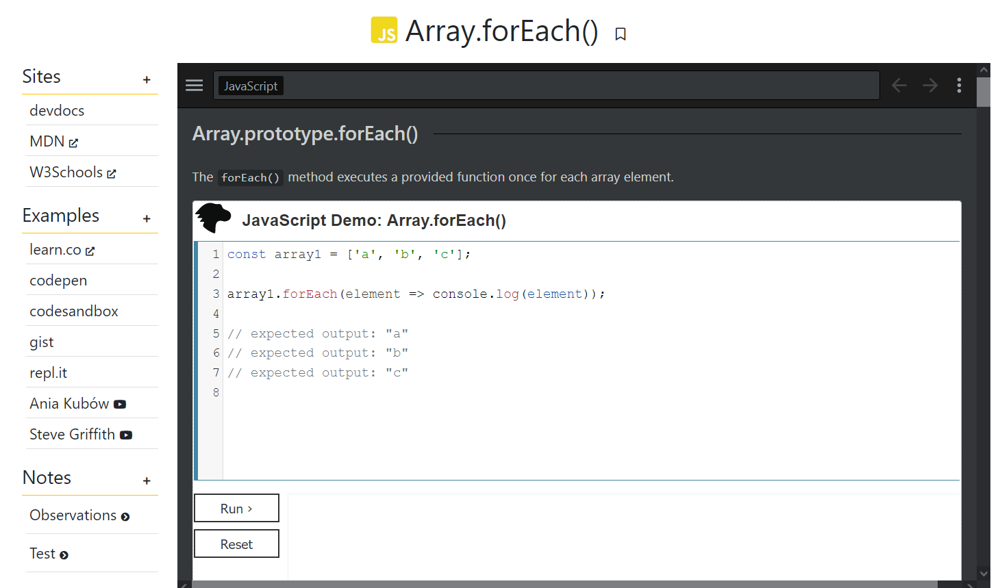

# Devvy ([Harvard's CS50W](https://online-learning.harvard.edu/course/cs50s-web-programming-python-and-javascript?delta=0) final project; Capstone)

*Devvy* is a **reference collection site for developers** that allows users to explore, add, annotate and watch content on language references in their own context. 
If you take JavaScript's `array.forEach()` method as an example, you could view and add reference sites and content, examples, and keep your own notes for that specific "entry".
Wherever possible, the content on each entry is shown within the site, while pages that don't allow it will be displayed on new tabs.
Besides keeping notes in your own account, you can also bookmark entries, search for more and/or add new ones. 
The index page allows for navigation by language, showing all entries available for each language.

## Distinctiveness and complexity requirements

> *Your web application must be sufficiently distinct from the other projects in this course and more complex than those.*

This project is not a network, mail client nor a commerce site. Furthermore, those projects where based on specific teachings (e.g: incorporate models and migrations for commerce, JavaScript for mail, etc) while *Devvy* requires, at least, all of them in conjunction to properly work (see project description and files table).

> *A project that appears to be a social network is a priori deemed by the staff to be indistinct from Project 4, and should not be submitted; it will be rejected.*

While *Devvy* allows for user accounts and annotation, there is no social component to it and users cannot interact with each other nor with each other's content besides viewing all entries on site. It's main strength relies on content compilation.

> *A project that appears to be an e-commerce site is strongly suspected to be indistinct from Project 2, and your `README.md` file should be very clear as to why it’s not. Failing that, it should not be submitted; it will be rejected.*

Contrary to other projects, *Devvy* does not display nor allow keeping track of any physical or intangible product.The purpose of the main content is to educate and serve as reference, annotation and example. 

## Project structure and file contents

On the **back-end** there are four models: **User** for user accounts; **Entry** for language specific functions/items; **Site** for reference and example pages; and **Note** for user annotations. These last three items also have their own form objects at `forms.py`.
`urls.py` holds paths for 5 page views (index, entry, search, bookmarks and new entry), 3 user account views (login, logout and register), and 2 API views to work on the front with note and bookmark states.

On the **front-end** there are 8 html template files, 2 scripts, 1 stylesheet and some logo images.
- `layout.html` holds the basic structure of the page; navigation and search; style and script files; and external resources ([Bootstrap 5](https://getbootstrap.com/docs/5.0/getting-started/introduction/) and [Fontawesome](https://fontawesome.com/)).
- `index.html` Shows a sub-navigation menu on top representing each language. When one is chosen, it is displayed using [Bootstrap's tab navigation](https://getbootstrap.com/docs/5.0/components/navs-tabs/#javascript-behavior).
  The page keeps track of chosen languages using an inline script (lines 64 to 97) that changes the main content and pushes new states to history after navigating each tab.
	
- `login.html`, `logout.html`, `register.html`, and `new_entry.html` show forms for users to perform the corresponding actions. Each redirect to their own view while some include a hidden field specifying the current url to redirect users after logging in.
- `entry.html` displays the selected entry contents. 
  The title shows the name of the entry prepended by the language icon and appended by a bookmark button (if the user logged-in).
	On the left/top (depending on resolution), there's a menu including reference sites, examples and notes each with its own button (+) to add new content. On the right/bottom, the main content depending on selection. 
  By default, the page shows embedded reference contents from [devdocs](https://devdocs.io). If the site is external, a note or in video format, a distinct icon will be shown on its right and the link will perform the corresponding action (open a new tab, embed a video or a specific note view).
	
	Actions on this page such as add, update, edit or delete content; bookmark entries, update the menu placement depending on resolution, show tooltips, and process and display content internally or externally depend on listeners specified at `script.js` and `entry.js`. Both also include the necessary functions to alter aspect and behavior and calls to the corresponding `urls.py` "API" views when data is needed from/modified in the 'server'. 
	There are two separate script files because `entry.js` is not needed on the other pages and its placement (within `templates` rather than in `static`) is due to the need of processing Django template data (e.g. `{{ entry.name }}`);it loads at the end of `entry.html` using ``.

|File|Content|
|----|-------|
| urls.py |  Holds views for pages, user account actions, and API calls |
| models.py |  Keeps models for `User`, `Entry`, `Site`, and `Note` objects   |
| forms.py | Provides forms for new entries, sites and notes |
| templates/devref/layout.html | Basic html structure and external files |
| templates/devref/login.html | Allows users to log-in  |
| templates/devref/logout.html | Allows users to log-out |
| templates/devref/register.html | Allows visitors to register |
| templates/devref/index.html | Presents content for the homepage |
| templates/devref/entry.html | Presents content for specific entries |
| templates/devref/entry.js | Holds scripts needed for `entry.html`'s functionality |
| templates/devref/new_entry.html | Form to add a new entry to the site|
| templates/devref/search.html | Shows results after a search |
| templates/devref/bookmarks.html | Shows bookmarked entries |
| static/devref/logo2.png | Current used logo |
| static/devref/script.js | Adds listeners and functions to manage how sites and languages are shown and loaded |
| static/devref/style.css | Custom and Bootstrap overridden styles |

## How to run
The site can be run [as any other CS50W project](https://cs50.harvard.edu/web/2020/notes/3/#django). Assuming a browser, Django and Python are installed on the system, a `py manage.py runserver` command can be run at `/08b.final project/capstone/` and the provided local URL can be visited in order to access the site.

- [Video showcase - YouTube](https://youtu.be/BPfBD0g5R14)
- [Project requirements - CS50W](https://cs50.harvard.edu/web/2020/projects/final/capstone/)
- [CS50's web programming with Python and JavaScript](https://cs50.harvard.edu/web/2020/)
